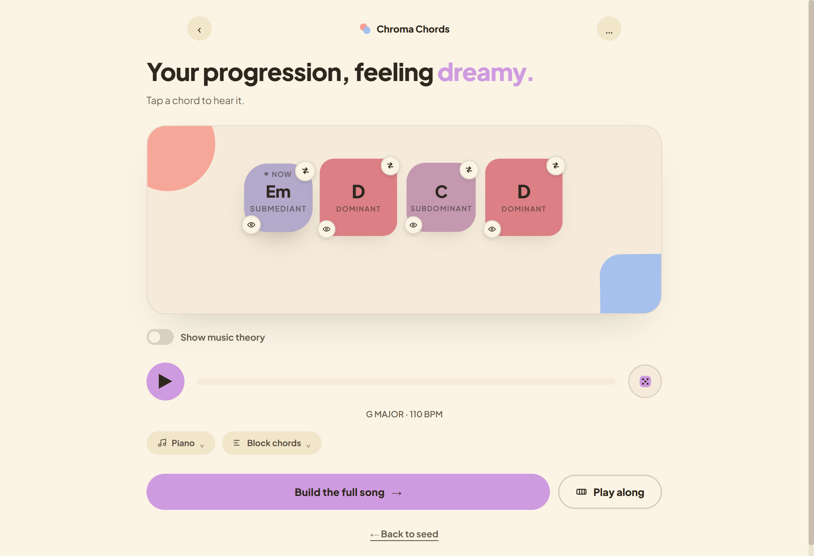

# Chroma Chords

> *"A tactile audio widget for generating pleasing chord progressions in seconds."*

**Chroma Chords** is designed to completely eliminate friction when exploring musical ideas. Built as a fast, tactile web application, it lets you instantly seed chord progressions by natural vibe prompts, genre, and mood, swap chords with intelligent harmonic recommendations, customize voicings, view music theory analysis, arrange full songs, and export seamless loops directly to your DAW or hardware.

---

[](https://warmsynths.github.io/chroma-chords)

**[👉 Launch Live App](https://warmsynths.github.io/chroma-chords)**

---

## The Philosophy

Opening a DAW, loading heavy virtual instruments, configuring MIDI routings, and manually clicking notes into a piano roll often destroys the creative spark before an idea takes shape.

**Chroma Chords** acts as your instant progression sketchpad:
* **Audio Widget Simplicity:** Designed to look beautiful, feel tactile, and generate great-sounding chord loops with zero setup or menu diving.
* **Seed by Feel or Vibe:** Type a natural vibe (*"rainy drive at 2am"*, *"Portishead"*, *"80s synthwave"*) or pick from 23+ genres and 6 moods to instantly roll a progression.
* **Intuitive Swap Sheet:** Tap any chord card to view harmonic alternative suggestions (*Darker, More tension, Dreamier, Resolve home*) or customize exact voicings and extensions.
* **Music Theory Made Visual:** Toggle theory mode to see Roman numeral notation, degree functions (*Tonic, Mediant, Dominant, etc.*), interactive staff notation, and harmonic tension maps.
* **From Loop to Song:** Seamlessly transition from a 4-chord loop into a multi-section song structure (*Intro, Verse, Pre-Chorus, Chorus, Bridge, Outro*).
* **Instant Hardware & DAW Helpers:** Export progressions directly into MIDI, studio WAV, Dirtywave M8 (`hypersyn-chord-helper`), and Novation Circuit (`circuit-chords`).

---

## App Features & Capabilities

### 🎨 Intelligent Seeding & Vibe Classification
* **Natural Language Vibe Search:** Freeform prompt classifier powered by instant local keyword heuristics and cloud AI (Google Gemini, OpenRouter, and Claude Haiku via Cloudflare Worker) to translate mood phrases into matching progressions, tempos, instruments, and play styles.
* **23+ Musical Genres:** Curated harmonic probability rules for Pop, Lo-fi/Chill, R&B/Soul, Indie/Folk, Synthwave, Jazz-ish, Gospel, Cinematic, Rock, House/Dance, Blues, Funk/Disco, Country/Bluegrass, Reggae/Dub, Ambient/Drone, Trap/Hip-Hop, Bossa Nova/Latin, EDM, and more.
* **6 Distinct Moods & Custom Lengths:** Uplifting, Melancholy, Dreamy, Tense, Warm, and Nostalgic profiles with customizable progression lengths from 2 to 8 chords.

### 🎹 Tactile Playback & Sound Engine
* **Tone.js Synthesizers & Sound Engines:** High-quality built-in instruments including Rhodes, Acoustic Piano, Nylon Guitar, Lush String Pads, Juno Synth Pads, FM Electric Piano, Bells, Organs, and House Stabs.
* **Dynamic Play Styles & Arpeggiator:** Switch between block chords, strumming, broken swing, and customizable arpeggios (with selectable octave range, rates, and patterns).
* **Fluid Drag-to-Reorder:** Reorder chord cards on the fly while preserving playback timing and identity.
* **Key & Scale Overrides:** Shift progressions across all 12 root keys and modal scales (Major/Ionian, Minor/Aeolian, Harmonic Minor, Dorian, Mixolydian, Lydian).

### 🎼 Music Theory & Voicing Tools
* **Interactive Swap Sheet:** Context-aware harmonic alternatives grouped by emotional shift (*Darker, More tension, Dreamier, Resolve home*).
* **Voicing Inspector:** Invert chords, adjust octave registers, and audition individual notes.
* **Live Staff Notation & Roman Numerals:** Dynamic SVG sheet music rendering with key signatures, Roman numeral analysis, and harmonic role tags.

### 🛠️ Song Arranger & Play-Along Modes
* **Song Structure Mode (`SongScreen`):** Arrange complete song structures from verse to chorus with automated section variations and continuous multi-section playback.
* **Interactive Play-Along (`PlayAlongScreen`):** Strum chords in real-time with responsive touch, keyboard controls, and pedal controller integration.

### ☁️ Cloud Sync & Export Workflows
* **Standard MIDI (`.mid`) Export:** Download clean MIDI files with accurate velocities, duration, and humanized micro-timing ready for your DAW.
* **Browser-Rendered WAV (`.wav`) Audio:** Offline 16-bit PCM WAV rendering directly inside the browser matching chosen instrument patches and play styles.
* **Hardware & Web Share Links:** Generate instant load links for Dirtywave M8 (`hypersyn-chord-helper`), Novation Circuit (`circuit-chords`), and shareable web URLs.
* **Cloud Accounts & Project Sets:** Authenticate with Supabase to sync progression sets, project bookmarks, and access saved sets anywhere with offline fallback.

---

## Technical Stack

* **Frontend Architecture:** [Lit](https://lit.dev/) (v3) Web Components with zero bloated framework overhead.
* **Audio Engine:** [Tone.js](https://tonejs.github.io/) for Web Audio synthesis, polyphonic scheduling, and offline WAV rendering.
* **Language & Type Safety:** 100% [TypeScript](https://www.typescriptlang.org/).
* **Styling:** Design token system with fluid CSS animations and OKLCH color palettes.
* **Backend & Sync:** [Supabase](https://supabase.com/) for authentication and database storage; [Cloudflare Workers](https://workers.cloudflare.com/) for AI vibe classification and cloud synchronization.
* **Build & Testing:** [Vite](https://vite.dev/) and [Vitest](https://vitest.dev/).

---

## Getting Started

### Prerequisites
- Node.js 18+ (or 20+)
- npm

### Installation & Development
1. Clone the repository and install dependencies:
   ```bash
   npm install
   ```
2. Start the local development server:
   ```bash
   npm run dev
   ```
3. Open the local URL (e.g. `http://localhost:5173`) in your browser.

### Running Tests
Execute unit and integration tests via Vitest:
```bash
npm test
```

### Production Build
Compile TypeScript and build the production bundle (outputs to `docs/` for GitHub Pages hosting):
```bash
npm run build
```

---

## License

This project is licensed under the terms described in the [LICENSE](LICENSE) file.
